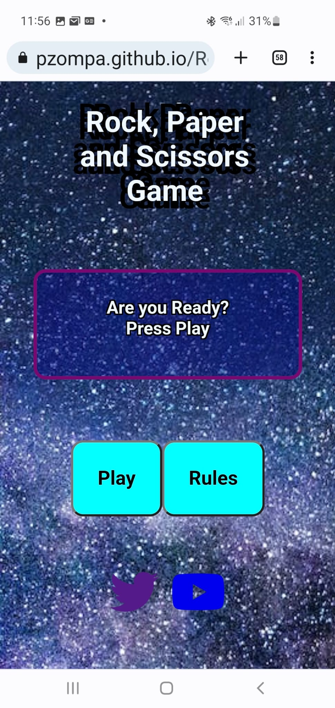
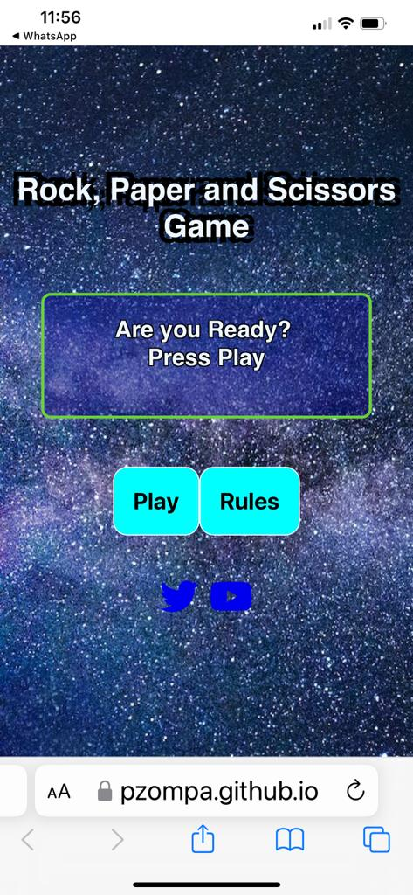

# Project 2 JS: Rock, Paper and Scissors Game
## Project Goals:
* The main goal of the Website is to provide the user with an easy-to-understand interactive JavaScript base game.
View the live website [here](https://pzompa.github.io/Rock-Paper-Scissor-Game/).

---
## Site Owner Goals:
* To host an entertaining website.
* To create a simple game to pass time.
* To maximise reachability by creating a Browser based game.

---
## User Experience(UX):
### First Time Visitor:
* I want to easily understand the websites function and purpose.
* I want to easily navigate through the game.
* I want to easily understand the rules of the game.
### Returning Visitor Goals:
* I want to replay the game.
* I want to find out if there are updates to the game.
---
## Design:
### Colour Scheme:
* The buttons are in bright aqua color to attract attention to  them and changes color to white on hover.
* The title of the game has a subtle black shadow which is appealing without being too loud.
* Based on screen sizes, different border color is used to make it more appealing.

### Typography:
* The main font used in this project is Golos. In case for any reason the Golos isn’t being imported correctly, Sans Serif is used as the fall back font. 
* Golos is aesthetically very appealing and appropriate for this game.

### Imagery:
* A galaxy background image is used to have a mysterious and soothing effect on the user. 
---
## Wireframes:
* For Desktop
  * Initial Screen Wireframe
  

  * Game Screen Wireframe
  

  * 404 Page
  

* For Mobile
  * Initial Screen Wireframe
  

  * Game Screen Wireframe
  

---
## Features:
* This Game contains 2 different layouts and a 404 page.
* Initial Screen
   * The user is invited to play the game
   * the user can view the rules of the game.
   * The rules of the game is provided in a easy to  
     understand  modal image.
* Play Screen
  * Once the user clicks the play button, he is taken to the play screen, where he has an option to play, quit the game, reset the scores or see the rules again if he chooses. 
* 404 page
  * If the user tries to navigate to a non existing page, the user is presented with a 404 error page, where a link back to the home page is available.
* (Add Images of the pages here)
---
## Technologies used:
* HTML5
  * This Website was developed using HTML5.

* CSS3 
  * This Website was styled using CSS in an external file.

* JavaScript
  * JavaScript was used in this website to make the site more interactive
* Visual Studio Code
  * This Website was developed using Visual Studio Code IDE

### Frameworks and Tools used:

* GitHub
  * Source code is hosted on GitHub

* Git
  * Used to commit and push code to GitHub in the gitpod terminal

* Am I Responsive
  * [Am I Responsive](https://ui.dev/amiresponsive) was used to create mockup of the website on different screen sizes.

* Font Awesome
  * [Fontawesome](https://fontawesome.com/) was used for the social media links in the footer section of all the screens and pages.

* Lighthouse
  * [Lighthouse](https://chrome.google.com/webstore/detail/lighthouse/blipmdconlkpinefehnmjammfjpmpbjk?hl=de) was used to test performances of each Pages on both desktop and mobile screens. 

* Favicon.io
  * Favicon files were created at [this Website](https://favicon.io/)
---
## Features to be implemented
* User data storage for returning Visitor.
* To store Top ten player scores.

---
## Testing
### HTML validation
* [W3C Markup Validator](https://validator.w3.org/) was used to check the validity of the HTML code and returned no error.

### CSS validation
* [W3C CSS validator](https://jigsaw.w3.org/css-validator/) was used to check the validity of the CSS code and returned no errors.

### Wave Test
* Tests with [Wave testing](https://wave.webaim.org/report#/https://pzompa.github.io/Rock-Paper-Scissor-Game/) was  conducted to ensure that the content is accessible to user with disadvantages and returned no errors or issues.

### JS validation
* [JSHint](https://jshint.com/) was used to check the validity of the JavaScript code used for the website. No errors was found.

### Lighthouse Test
* A test was conducted using Lighthouse within Google Chrome to verify performance and accessibility standards and found no issues.
* Desktop Analysis:
  * 
  * 
  

* Mobile Analysis:
  * 
  * 

### Button/Function Testing:
* All the buttons has been tested and they navigate the user to the right pages, screens and content as expected. 
* All tests conducted on different screen sizes and functions as expected.

| Screen         | Button      | Notes |
|---	           |---	         |---	   |
| Initial screen: | runGame Function | Initial screen is loading properly |
| Initial screen: | Play button | The Play button function is working properly. The second screen is loading as intented. All elements on the second screen are displayed properly. |
| Initial screen: | Rules button | Rules modal screen opened properly. Overlay blocks and blurres the background as intended. Modal screen closes when: clicked on close, Esc key, and clicked anywhere on the overlay part of the screen. |
| Initial screen: | Message | Text is displayed correctly |
| Initial screen: | Social Media | YouTube and Twitter links opens in a new window as intented |
| Game screen: | (initial) Message | Text is displayed correctly |
| Game screen: | (initial) Score | Score is properly shown as "0" |
| Game screen: | Score | Scores are incrementing properly as intended. |
| Game screen: | Rock,Paper,Scissors | Images are displayed properly. Click event and functions are working as intended. |
| Game screen: | Reset Button | Scores are reset properly to "0" as intended |
| Game screen: | Rules Button | Rules modal screen opened properly. Overlay blocks and blures as intended. Modal screen closes when: clicked on close, Esc key, and clicked anywhere on the overlay part of the screen. |
| Game screen: | Quit Button | Exits the game and loads the initial screen as intended |
| Game screen: | (during game) Message | Random computer choice is computed properly and user choice is registerd properly. Win, lose or draw massage is displayed proplerly |

### Responsiveness Testing:
* All the pages were tested on different screen sizes
* Samsung S10:

* IPhone12 MAX Pro:

* Mac Pro Desktop:

* Website was opened on the following Browsers:
  * Chrome
  * safari and
  * Firefox.

* Website was also opened on the following devices:
  * Iphone 12
  * Iphone 11 and
  * Samsung Galaxy s10
  * Ipad Pro.
* There were no responsive issues seen on all screen sizes.
* All the pages displayed and functioned as expected.
---
## Deployment

### Version Control
* The site was created using the Visual Studio code editor and pushed to github to the remote repository **‘Rock-Paper-Scissors-Game’**.
* The following git commands were used throughout development to push code to the remote repo:
* `git add <file>` - This command was used to add the files to the staging area before they are committed.
* `git commit -m "commit message"` This command was used to commit changes to the local repository queue ready for the final step.
* `git push` This command was used to push all committed code to the remote repository on github.
### Deployment to GitHub Pages 
 The following steps were used to deploy the website using GitHub Pages:

* In the GitHub repository, navigate to the 'Settings' tab.
* On the left hand menu select 'Pages'.
* For the source section, select 'Branch: Main'.
* Click Save.
* A live link will be displayed in a green banner when published successfully. 
* After a few minutes, the website will be build and deployed.
* The live link can be found [here](https://pzompa.github.io/Rock-Paper-Scissor-Game/)

### Forking the repository:
By forking the GitHub Repository we make a copy of the original repository by using the following steps...
* Go to the GitHub repository.
* Click on 'Fork' button in upper right hand corner.
* Select 'Create new fork' from the drop-down menu.

## Clone the Repository:
* Click on the code drop down button
* Click on HTTPS
* Copy the repository link to the clipboard
* Open your IDE of choice (git must be installed for the next steps)
* Type git clone copied-git-url into the IDE terminal
* The project will now of been cloned on your local machine for use.
## Credits:
### Content and Media:
* Used [image](https://www.vecteezy.com/vector-art/691497-rock-paper-scissors-neon-icons) from Rock Paper Scissors Game Vectors by Vecteezy.
* Used [image](https://commons.wikimedia.org/w/index.php?curid=27958688) by Enzoklop for the Rules modal.
* The modal codes were inspired by the [freecodecamp.org](https://www.freecodecamp.org/news/how-to-build-a-modal-with-javascript/#:~:text=In)
* [w3c website](https://www.w3schools.com/js/) was used extensively to test various JS codes.
* [YouTube Tutorial](https://youtu.be/ec8vSKJuZTk) for JS based game was used for initial conception inspiration.
* Google was used extensively for research and clear doubts throughout this project.

### Acknowledgment:

--- 
